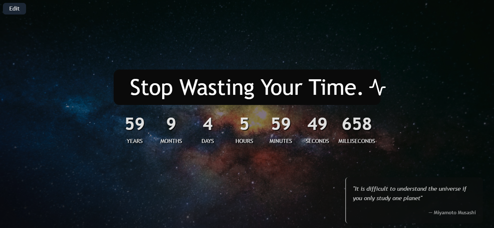

# Fading Time ⌛

A minimalist browser extension that replaces your new tab with a life countdown timer, reminding you that time is ticking. Stay focused, live wisely.

## Features

- Displays a countdown based on your estimated lifespan or a custom deadline.
- Background featuring a serene cosmic theme.
- Rotating daily quotes from Stoicism, Zen, Taoism, and other philosophical traditions.
- Lightweight and optimized for performance (Svelte-based).

## Installation

1. Download the extension from the [Chrome Web Store](#) (coming soon!).
2. Or install manually:

   - Clone this repository.
   - Build the extension by running `npm i` & `npm run build`.

   - Open `chrome://extensions/` in Chrome.

   - Enable Developer Mode.

   - Click "Load unpacked" and select the `./fading-time/dist` folder.

## License

This project is open source because knowledge and time should be shared.
[MIT License](./LICENSE.md)

## Future Support 🚀

This was just a weekend speed-run project since the extension I was using lacked some features. It’s simple, neat, and does what it’s meant to do.

I _might_ add support for other browsers in the future—but if you want to see it on a different browser, feel free to open a pull request! I’d be glad to support it if there’s interest.
